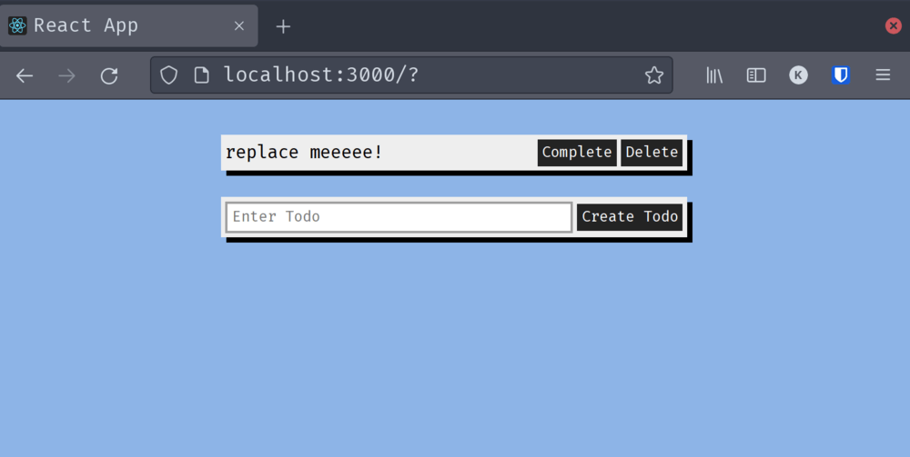

# Postgraphile and Graphql: Structure for Everyone

In this section we will create a [react][react] frontend that will use [apollo-client][apollo-client] to communicate with our new [postgraphile][postgraphile]/[postgresql][postgres] backend.

[postgraphile]: https://www.graphile.org/postgraphile/
[react]: https://reactjs.org/
[apollo-client]: https://www.apollographql.com/docs/react/
[postgres]: https://www.postgresql.org/

## Section 3a, React & Apollo - A Brief Interlude

If you are following along jump to **Start Section 3** below but if you are just now starting the tutorial at branch `section-3` you will want to make sure you have a postgres instance up and running with an appropriately configured `.env`. I have provided defaults that are not at all secure, at the very least a password change might be in order. Make sure to add `.env` to your `.gitignore` and then:

```sh
 yarn install && yarn global add db-migrate
 docker-compose -f todo_db/docker-compose.yml up -d
 db-migrate up
```

---

**Start Section 3a**

In this section, we will build the frontend of our todo list with React and Apollo. I have gone ahead and used `create-react-app` and built a very basic skeleton of a todo list without any real functionality. I thought I would spare you the boilerplate as this is probably the one zillionth todo tutorial. The code is all in the `client` directory. I have also added [cors][cors] to `server/index.js`. If you are not familiar with `cors`, checkout the documentation, or just know that it is neccesary to properly access our soon to be developed frontend in a browser. For those following along, please merge the changes in `server`.

[cors]: https://expressjs.com/en/resources/middleware/cors.html

There are also two additional options in `server/postgraphile.js`, `simpleCollections: 'only'` and `graphileBuildOptions: { pgOmitListSuffix: true }`. Feel free to add/subtract these incrementally and then execute queries against them to see what they are up to. `simpleCollections: 'only'` will remove the node/edges structure of the graphql queries. The results are less verbose and leave us with simply `todo` where we would have previously had `node: {todo}`. Our `todos` query becomes `todosList` and so `graphileBuildOptions: { pgOmitListSuffix: true }` removes the list suffix. With the combination of the two options we now get and array of todos from `todos` query. `classicIds: true` replaces `nodeId` with `id` and `id` with `rowId`. This will simplify our life with Apollo a little later as Apollo (appropriately) uses the `id` field to identify and cache our data and in the case of graphql this is actually what we were previously calling `nodeId`. Note that none of these options are specifically neccesary, but enabling them allows our code on the frontend to be a little cleaner. Make sure that you run a few queries and look at the documentation in graphiql before proceeding.

Now, before we dig into the client let's take a moment and explore how we might implement queries with dynamic input in `graphiql` before we start hard coding the queries in `client/src/graphql.js`. In `server/postgraphile.js` we have a couple settings that allow us to continue to experiment in graphiql `graphiql: true` and `enhanceGraphiql: true`. Go ahead and browse to `127.0.0.1:3333/graphiql` (PORT is set in .env and unless you have changed it, will be 3333). In the second column/pane of the graphiql interface lets define a new query which will take a variable as its argument (and note the new `rowId` and `id` fields):

```gql
query getTodo($myRowId: Int!) {
  todo(rowId: $myRowId) {
    id
    rowId
    task
    completed
  }
}
```

Query `getTodo` will take an argument `$myRowId` that is an `Int` type(`!` for required) and will execute `todo()` with the `rowId` field set to `$myRowId`. If we were to run this query graphiql will get angry and will not produce any useful results. We need to define `$myRowId` with a value in the small pane labled "query variables" at the bottom of the second column:

```gql
{"myRowId": 4}
```

Assuming that you have a todo with the rowId of 4, its fields will be fetched and displayed in the third column. And if you do not, maybe first query all the todos, or maybe we should just make a new todo with our new variable syntax. Try making a new todo with the task of "take over the world", or whatever you might be working on for the evening.

<details>
<summary>Check here for my version</summary>

```gql
mutation NewTodo($newInput: CreateTodoInput!) {
  createTodo(input: $newInput) {
    todo {
      rowId
      id
      task
      completed
    }
  }
}
```

In "query variables":

```gql
{
  "newInput": {
   "todo": {
     "task": "take over the world"
   }
 }
}
```

or...

```gql
mutation NewTodo($newTask: String!) {
  createTodo(input: { todo: { task: newTask } }) {
    todo {
      rowId
      id
      task
      completed
    }
  }
}
```

In "query variables"

```gql
{"newTask":"Take over the world"}
```

</details>

I prefer the second approach and it will the one that will be used throughout the rest of the tutorial.

The documentation on [queries][queries] on graphql.org is excellent. Have a look.

[queries]: https://graphql.org/learn/queries/

Now I guess we should build something. Lets `cd client && yarn install`. This will give us the skeleton react app I spoke of previously, `@apollo/client` and `graphql`, which should be everything we need to finish this section.

And then pretty much straight from the Apollo [documentation](https://www.apollographql.com/docs/react/get-started/) is...

```js
/* client/src/index.js */

import React from 'react';
import ReactDOM from 'react-dom';
import App from './App';
import { ApolloClient, InMemoryCache, ApolloProvider } from '@apollo/client';

const client = new ApolloClient({
  uri: 'localhost:3333/graphql' /* this should is localhost:PORT/graphql from toplevel .env*/
  cache: new InMemoryCache(),
});

ReactDOM.render(
  <ApolloProvider client={client}>
    <App />
  </ApolloProvider>,
  document.getElementById('root')
);
```

We define a new apollo client and then wrap the top level react component with it. This wrapping should look familiar if you have ever used a state management library like redux or even react context. Except our store is a reactive, caching graphql client backed by a postgres database. Neato!

Now we need some react components and probably some graphql queries. Our component structure will be typical of a react todo tutorial with an App.js, a TodoList.js, and a Todo.js, and we will place all of our graphql queries/mutations in `client/src/graphql.js`. These should look very familiar from our prior adventures with graphiql.

```js
/* client/src/graphql.js  */

import { gql } from '@apollo/client';

/* get all todos */
export const GET_TODOS = gql`
  query GetTodos {
    todos {
      id
      task
      completed
    }
  }
`;

/* create a todo */
export const CREATE_TODO = gql`
  mutation CreateTodo($task: String!) {
    createTodo(input: { todo: { task: $task } }) {
      todo {
        id
        task
        completed
      }
    }
  }
`;

/* update "completed" field */
export const UPDATE_COMPLETED = gql`
  mutation UpdateCompleted($completed: Boolean!, $id: ID!) {
    updateTodoById(input: { patch: { completed: $completed }, id: $id }) {
      todo {
        id
        completed
      }
    }
  }
`;

/* delete a todo */
export const DELETE_TODO = gql`
  mutation DeleteTodo($id: ID!) {
    deleteTodoById(input: { id: $id }) {
      deletedTodoId
    }
  }
`;
```

Before we start engineering out way to graphql wonderfulness with apollo make sure that executing `yarn start` in the client directory brings you up a wonderful todolist in your browser at `localhost:3000` (default port for `create-react-app`). A screenshot is hiding below the drop for your reference.

<details><summary>Look at Meeeee!</summary>
</details>

The css is all consolidated in `client/src/App.css`; Change it as you like, but know that I do find that color blue to be very pleasant... At this point I highly recommend the Apollo Client DevTools [extension][extension] for Mozilla Firefox or Google Chrome. It makes this part of the journey a little easier, and much more fun.

We will start wiring up apollo in `client/src/TodoList.js`, where we will fetch all of our todos and possibly create a new todo.

[extension]: https://www.apollographql.com/docs/react/development-testing/developer-tooling/#apollo-client-devtools

Apollo has excellent documentation. Have a look at the [useQuery API][usequery] before we begin. useQuery can takes mann options and returns a Results object with many possible properties. We are currently only concerned with passing a query and recieving the `error`, `loading`, and `data` properties as the result.

[usequery]: https://www.apollographql.com/docs/react/data/queries/#usequery-api

We will first need a couple imports appended to our list in `client/src/TodoList.js`.

```js
...

import { useQuery } from '@apollo/client'
import { GET_TODOS } from './graphql'

...

```

Now we can remove the placeholder todo and replace it with a query:

```js
{error, loading, data} = useQuery(GET_TODOS)
if (error) return <p className="alert">{error.message}</p>;
if (loading) return <p className="alert">loading...</p>;
const { todos } = data;
```

We simply return the error or a loading placeholder and destructure our todos out of the data.

Fire it up! But all that work just to render a todo list? Just wait, there is more. On to mutations over in `client/src/Todo.js`. As always some [documentation][mutations] on mutations is in order. First we will implement updating our `completed` field. Just as with our query a couple imports:

```js
/* client/src/Todo.js */

...

import { useMutation } from '@apollo/client'
import { UPDATE_COMPLETED } from './graphql'

```

The syntax for `useMutation` is very similar to `useQuery`. One important difference is that `useMutation` will return to us a function that we will call when we actually want to execute the mutation. Under our new imports lets add a call to useMutation:

```js
...

const [updateCompleted, { error, loading, data }] = useMutation(UPDATE_COMPLETED);
if (error) return <p className="alert">{error.message}</p>;
if (loading) return <p className="alert">loading...</p>;

```

Then we will call the `updateCompleted` function in our `handleCompleteClick` function

```js
...

 const handleCompleteClick = async (id) => {
    try {
      await updateCompleted({
        variables: { id: id, completed: !completed },
      });
    } catch (e) {
      console.log(e);
    }
  };
```

We use async/await syntax in a try/catch block because `updateCompleted` returns a Promise that will reject upon error and crash our UI. Oh No! Note that this is the bare minimum of error handling. More complete methods involve passing an `onError` callback function to `useMutation`, or defining global error handling policies with Apollo Link.

But more importantly for us (for now at least) is the lack of `data`. Start up the client and check it out.

Magic!

From the docs:

> In most cases, a mutation response should include any object(s) the mutation modified. This enables Apollo Client to normalize those objects and cache them according to their \_\_typename and id fields.

Beyond a simple example such as this we could use the `{loading, error, data}` properties to conditionally render our component, but for now it is enough that the data will hit the apollo cache and force a rerender of our todo.

Let's now proceed with creating a new todo. We first add the appropriate import in `client/src/TodoList.js` and call `useMutation` with our `CREATE_TODO` mutation:

```js
...

import { useQuery, useMutation } from '@apollo/client';
import { GET_TODOS, CREATE_TODO } from './graphql';

const [createTodo] = useMutation(CREATE_TODO)
...
```

We will not worry about `{data,error,loading}` for the time being. Lets wire up our new `createTodo` function in the form element.

```js
...
  <form
        className="todo-list__form"
        onSubmit={async (e) => {
          e.preventDefault();
          try {
            await createTodo({
              variables: { task: input },
            });
          } catch (error) {
            console.error(error);
          }
          setInput('');
        }}
      >
...
```

This gets us much of the way there but if we check out the client in the browser we are not getting a magic rerender. We must manually refresh to have our new todo displayed. While apollo adds the new todo to the cache, it needs a little help actually adding the reference to that new todo in our root query (Apollo cannot automagically update a list field and our root is just a list of refs). Open up the apollo devtools and have a look. There are two methods we can use to address this. We can refetch a query on calling the mutation by passing `refetchQueries` to `useMutation`:

```js
...
  const [createTodo] = useMutation(CREATE_TODO,{refetchQueries: [GET_TODOS]});
...
```

This fixes our UI and is a good method in general for synchronizing the frontend with the backend, but at the cost of an additional query. We are already returning the new todo with our mutation, why not just use it to update the cache directly. Apollo provides us with an option (actually a couple) to do just that.

Very much like we can pass an object with a `refetchQueries` property to `useMutation` we can also pass an `update` property which will be a function that will recieve `cache` and `mutationResult` from our client and allow us to utilize them to read and write queries directly to the cache, bypassing the need to query our server. Lets take a look:

```js
...
 const [createTodo] = useMutation(CREATE_TODO), {update: (cache, mutationResult) => {
      const todosQuery = cache.readQuery({ query: GET_TODOS });
      cache.writeQuery({
        query: GET_TODOS,
        data: {
          todos: todosQuery.todos.concat(mutationResult.data.createTodo.todo),
        },
      });
...
```

There are two functions we are using to access apollo client's cache, `readQuery` and `writeQuery`. Both take an object as an argument with property `query`. `readQuery` returns the result of the query against the cache, while `writeQuery` writes to the cache with the additional property `data`. We are simply querying for our list of todos and then concatenating it with the `mutationResult`(our newly created todo freshly returned from the `createTodo` mutation). If you look closely at the the network tab of your browsers devtools you will see we are only requesting and recieving exactly what we want at this point.

My browser is a little full at this point. Lets delete!

Deletion can proceed very much like insertion. First make sure we import the neccesary queries, call `useMutation` with `refetchQueries` and then add our mutation function to our click handler:

```js
...

import { UPDATE_COMPLETED, DELETE_TODO, GET_TODOS } from './graphql';
import { useMutation } from '@apollo/client';
const [deleteTodo] = useMutation(DELETE_TODO, {refetchQueries: [GET_TODOS]});

...

const handleDeleteClick = async (id) => {
  try {
    await deleteTodo({ variables: { id: id } });
  }
  catch(e) {
    console.log(e)
  }
};

....
```

Again, we are not appropriately dealing with errors, and that will have to be okay for now. We are not really pushing this production so I think we will survive (for now). As you can see we are refetching the entire list of todos, which is a little bit excessive when we are just trying to _boop_ a todo off our list. Lets try manipulating the cache through querying:

```js
const [deleteTodo] = useMutation(DELETE_TODO, {
  update: (cache, mutationResult) => {
    const { todos } = cache.readQuery({ query: GET_TODOS });
    cache.writeQuery({
      query: GET_TODOS,
      data: {
        todos: todos.filter(
          (todo) => todo.id !== mutationResult.data.deleteTodoById.deletedTodoId
        ),
      },
    });
  },
});
```

This go around our mutation result is just the `id` of our todo (since the todo is now gone), so we just filter the results of our query on the cache.

But there is another way!

```js
...

const [deleteTodo] = useMutation(DELETE_TODO, {
  update: (cache, mutationResult) =>
    cache.modify({
      id: 'ROOT_QUERY',
        fields: {
          todos(existingRefs) {
            return existingRefs.filter(
              (todo) =>
                todo.__ref !== `Todo:${mutationResult.data.deleteTodoById.deletedTodoId}`
            );
          },
        },
    });
    cache.gc()
})
...
```

While `cache.modify` allows us directly modify any part of the cache, it cannot add fields that do not already exist. In this case we only want to remove a todo from our root query, so that is not problematic. Typically one would call cache.identify() to retrieve the id of the object in the cache, but our case is so simple we can just access the root query which holds an array of refs to our todos. The `fields` property contains an object with a modifier function (or functions if we had more than one field we wished to change). Whatever this function returns will replace the existing contents of the cached field. Here we compare the `__ref` property of the todo array with a string that we have build out of our `mutationResult`. Refs in apollo take the form "\_\_typename:id". We can in fact change how the refs are named by apollo, but I find that the existing form is the most useful. Note that had we not changed the `nodeId` to `id` using `classicIds: true` in postgraphile this operation would be slightly more complicated, but not impossible. Finally we call cache.gc() as we have just removed a reference to an object that still sits in the cache (the actual todo), and this will clean it up.

And yet another one...

```js
...

const [deleteTodo] = useMutation(DELETE_TODO, {
  update: (cache, mutationResult) =>
    cache.evict({
      id: `Todo:${mutationResult.data.deleteTodoById.deletedTodoId}`,
    });
    cache.gc();
  },
});

...
```

This is my preferred method of deletion in this case, as the sole purpose of `cache.evict()` is to do just that. We supply the ref (or you can use `cache.identify()`) and cache.evict() _boops_ it. Then we call the `gc()` to make sure everything is right in the world.

Note the lack of useState or useEffect in all of the above queries/mutations. While it is probably some sort of reactjs heresy apollo does a fantastic job of managing state by its lonesome (a little credit should go to postgres/postgraphile). In fact with apollo client 3 local state can be integrated into the apollo cache so that it can act as a true global state management solution. Pretty neat stuff and certainly worth taking the time to explore.

And thats all folks. Our todo list operates as it should...

Except that we do not yet get automatic updates from other sources of database writes. What is going on? What if my project-manager/editor/cat wants to see whats going on and maybe add or remove something from our all important task list? In Section 3 it will be back to the wonderful land of `PL/pgSQL`, `pg_notify()`, and then subscriptions for everyone.

### The Most Brief Postscript on Field Policies

Before we start with subscriptions I have decided I would rearrange my code todo list just a bit. The `TodoInput` component has been pulled out of the `TodoList` component and I thought maybe we could simplify the `GET_TODOS` cache update. There is a wonderful way in which we can define the `merge` function that apollo client will use for any particular field. By default incoming data replaces what exists in Apollo's cache. This is very sensible for simple types, but for more complex types, like objects and arrays, it is often preferable to "merge" the incoming data with the existing data. This is what we are explicitly doing with:

```js
...
 const [createTodo] = useMutation(CREATE_TODO), {update: (cache, mutationResult) => {
      const todosQuery = cache.readQuery({ query: GET_TODOS });
      cache.writeQuery({
        query: GET_TODOS,
        data: {
          todos: todosQuery.todos.concat(mutationResult.data.createTodo.todo),
        },
      });
...
```

Apollo Client's `inMemoryCache` takes an optional `TypePolicy` object that allows for the definition of a [field policy][fieldpolicy]. The documentation is excellent on the subject so I will only say that we can define the default behavior of the cache as it pertains to merges(writing), reads(querying), and keys(identifying). We are concerned primarily with merges on our `todos` array so our `TypePolicy` will look like this:

```js
/* client/src/index.js*/
...

const client = new ApolloClient({
  uri: 'http://127.0.0.1:3333/graphql' /* variables from toplevel project .env */,
  cache: new InMemoryCache({
    typePolicies: {
      Query: {
        fields: {
          todos: {
            merge(existing = [], incoming) {
              return [...existing, ...incoming];
            },
          },
        },
      },
    },
  })
});

...
```

We are just concatenating via spread syntax our existing `todos` field with incoming `todos`. Note that we provide a default argument for `existing` as an empty array so that when we have no `todos` (like on startup) our client will not crash.

Now to simplifying our cache update in `TodoInput`:

```js
/* client/src/TodoInput.js */

const [createTodo] = useMutation(CREATE_TODO, {
  update: (cache, mutationResult) => {
    cache.writeQuery({
      query: GET_TODOS,
      data: {
        todos: [mutationResult.data.createTodo.todo],
      },
    });
  },
});
```

We remove our `readQuery` and simply define data as the incoming todo (as an array!). Note that we can no longer use the `readQuery`/`writeQuery` approach to delete from the cache.

...And another good example of the use of the `TypePolicy` object. At the beginning of this section I opted to use set the `classicIds: true` option for postgraphile. This allowed Apollo Client to properly identify each `todo` by its `NodeId` instead of its postgres `id` field. This in turn allowed us to easily identify our todo when updating the cache. The `keyFields` property of `TypePolicy` lets us use any field to identify an object in the cache. Using nodeId would look like:

```js
/* client/src/index.js*/
...

const client = new ApolloClient({
  uri: 'http://127.0.0.1:3333/graphql'
  cache: new InMemoryCache({
    typePolicies: {
      Todo: {
        keyFields: ["nodeId"]
      },
    }
  })
});
...
```

Try it out. We will continue to use `classicIds:true` in for the foreseeable future, but its nice to know we have options. { dataIdFromObject: (object) => object.nodeId }

P.S. Here's another (option for renaming...)

```js
const client = new ApolloClient({
  uri: 'http://127.0.0.1:3333/graphql'
  cache: new InMemoryCache({
    dataIdFromObject(responseObject) {
      switch (responseObject.__typename) {
        case 'Todo': return `Todo:${responseObject.nodeId}`;
      }
    }
  })
});
...
```

Okay that is seriously it.
